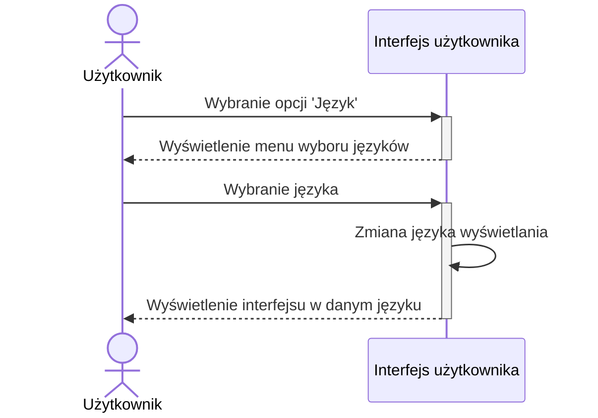
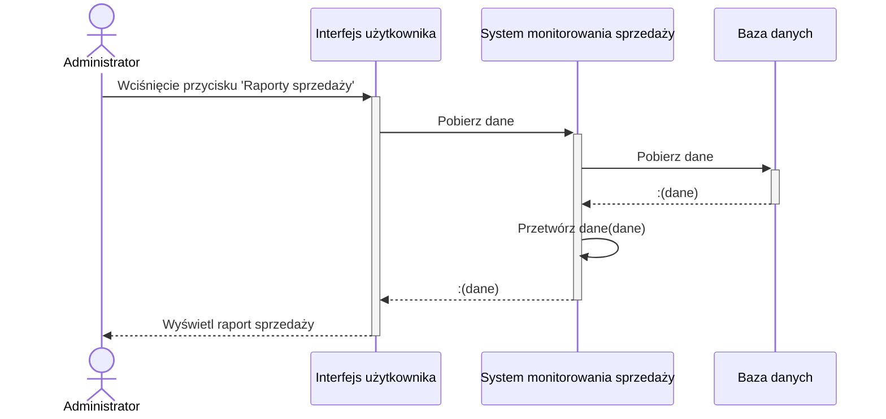
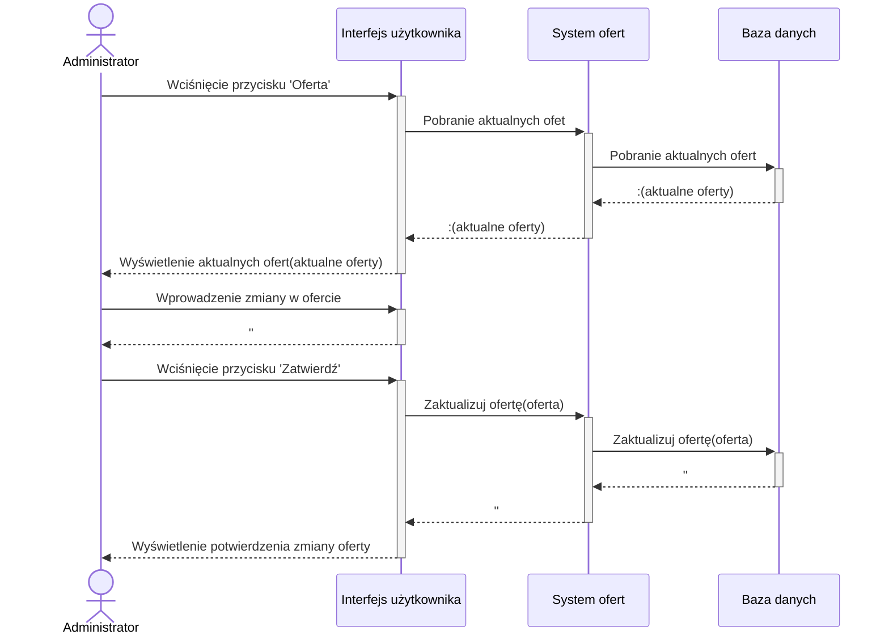
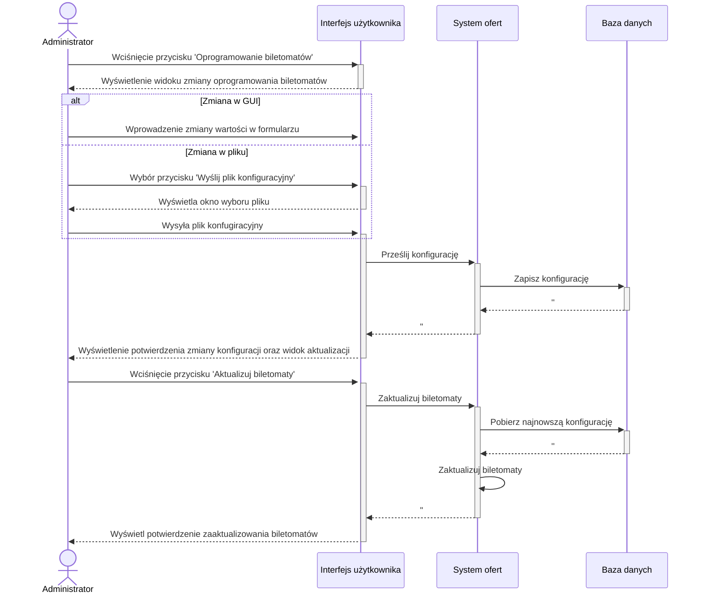
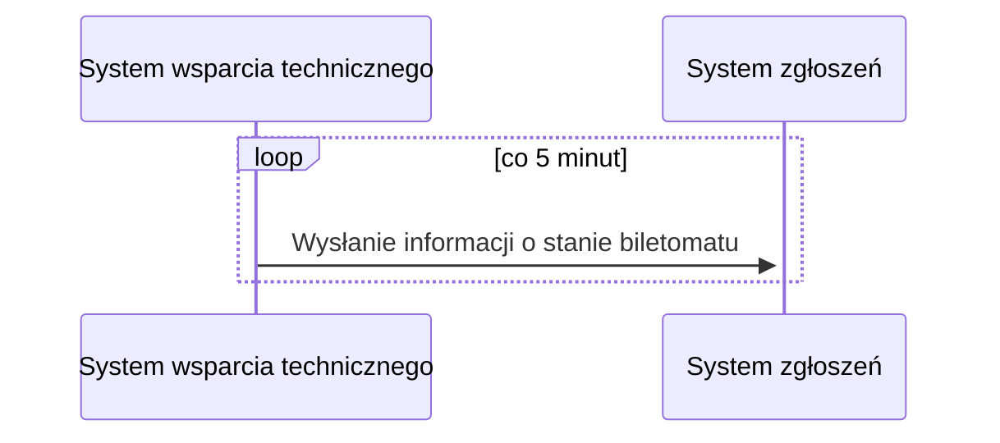
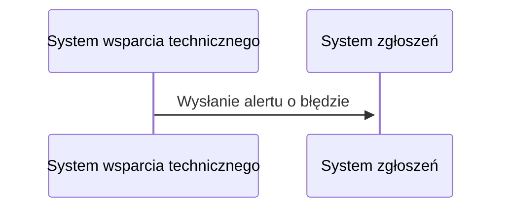

# Wybierz język

# Pozyskaj raport

# Konfiguruj dostępne bilety, promocje, taryfy

# Zdalne zaktualizowanie oprogramowania biletomatu

# Monitorowanie stanu biletomatów

# Wysłanie alertu o błędach i anomaliach

