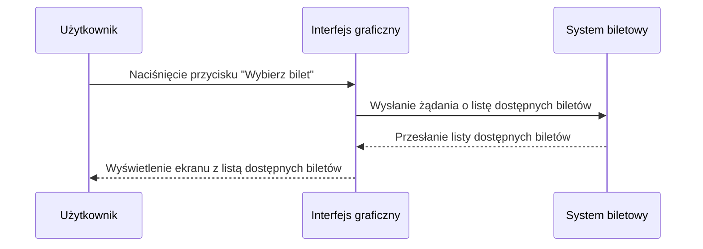
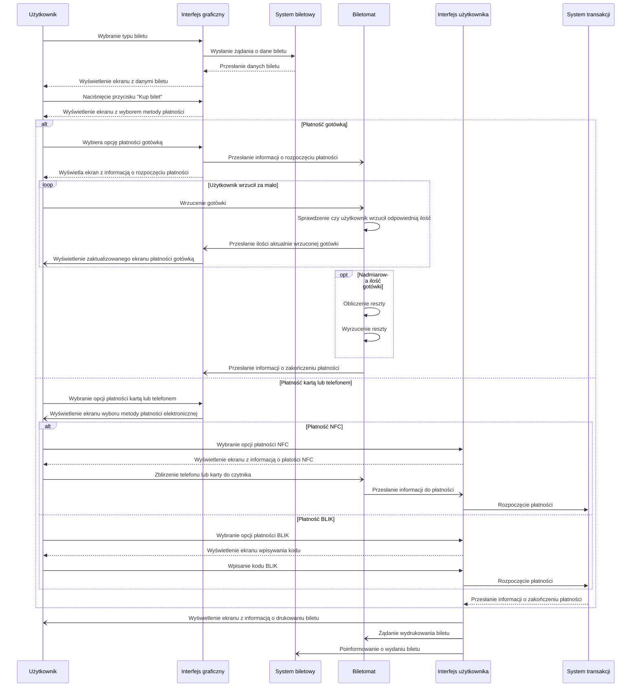

# Wyświetl ofertę

```mermaid
sequenceDiagram
    Użytkownik->>Interfejs graficzny: Naciśnięcie przycisku "Wybierz bilet"
    Interfejs graficzny ->> System biletowy: Wysłanie żądania o listę dostępnych biletów
    System biletowy -->> Interfejs graficzny: Przesłanie listy dostępnych biletów
    Interfejs graficzny -->> Użytkownik: Wyświetlenie ekranu z listą dostępnych biletów    
```

# Kup bilet, Płatność kartą lub telefonem, Płatność telefonem

```mermaid
sequenceDiagram
    Użytkownik->>Interfejs graficzny: Wybranie typu biletu
    Interfejs graficzny ->> System biletowy: Wysłanie żądania o dane biletu
    System biletowy -->> Interfejs graficzny: Przesłanie danych biletu
    Interfejs graficzny -->> Użytkownik: Wyświetlenie ekranu z danymi biletu
    Użytkownik ->> Interfejs graficzny: Naciśnięcie przycisku "Kup bilet"
    Interfejs graficzny -->> Użytkownik: Wyświetlenie ekranu z wyborem metody płatności
    alt Płatność gotówką
        Użytkownik ->> Interfejs graficzny: Wybiera opcję płatności gotówką
        Interfejs graficzny -) Biletomat: Przesłanie informacji o rozpoczęciu płatności
        Interfejs graficzny -->> Użytkownik: Wyświetla ekran z informacją o rozpoczęciu płatności
        loop Użytkownik wrzucił za mało
          Użytkownik -) Biletomat: Wrzucenie gotówki
          Biletomat ->> Biletomat: Sprawdzenie czy użytkownik wrzucił odpowiednią ilość
          Biletomat -) Interfejs graficzny: Przesłanie ilości aktualnie wrzuconej gotówki
          Interfejs graficzny -) Użytkownik: Wyświetlenie zaktualizowanego ekranu płatności gotówką
        end
        opt Nadmiarowa ilość gotówki
          Biletomat ->> Biletomat: Obliczenie reszty
          Biletomat ->> Biletomat: Wyrzucenie reszty
        end
        Biletomat -) Interfejs graficzny: Przesłanie informacji o zakończeniu płatności
    else Płatność kartą lub telefonem
       Użytkownik ->> Interfejs graficzny: Wybranie opcji płatności kartą lub telefonem
       Interfejs graficzny -) Użytkownik: Wyświetlenie ekranu wyboru metody płatności elektronicznej
       alt Płatność NFC
        Użytkownik ->> Interfejs użytkownika: Wybranie opcji płatności NFC
         Interfejs użytkownika -->> Użytkownik: Wyświetlenie ekranu z informacją o płatości NFC
         Użytkownik -) Biletomat: Zblirzenie telefonu lub karty do czytnika
         Biletomat -) Interfejs użytkownika: Przesłanie informacji do płatności
         Interfejs użytkownika ->> System transakcji: Rozpoczęcie płatności
       else Płatność BLIK
         Użytkownik ->> Interfejs użytkownika: Wybranie opcji płatności BLIK
         Interfejs użytkownika -->> Użytkownik: Wyświetlenie ekranu wpisywania kodu
         Użytkownik ->> Interfejs użytkownika: Wpisanie kodu BLIK
         Interfejs użytkownika ->> System transakcji: Rozpoczęcie płatności
       end
         System transakcji -->> Interfejs użytkownika: Przesłanie informacji o zakończeniu płatności
    end

    Interfejs użytkownika -) Użytkownik: Wyświetlenie ekranu z informacją o drukowaniu biletu
    Interfejs użytkownika -) Biletomat: Żądanie wydrukowania biletu
    Interfejs użytkownika -) System biletowy: Poinformowanie o wydaniu biletu
```
